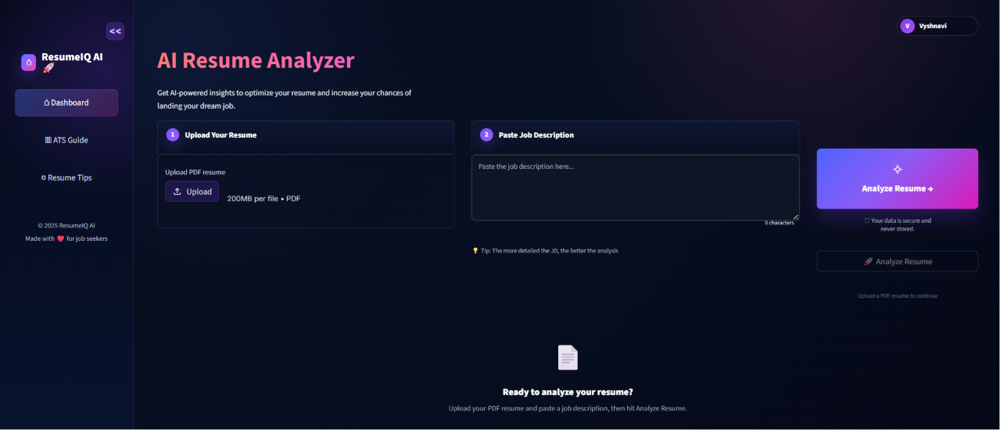
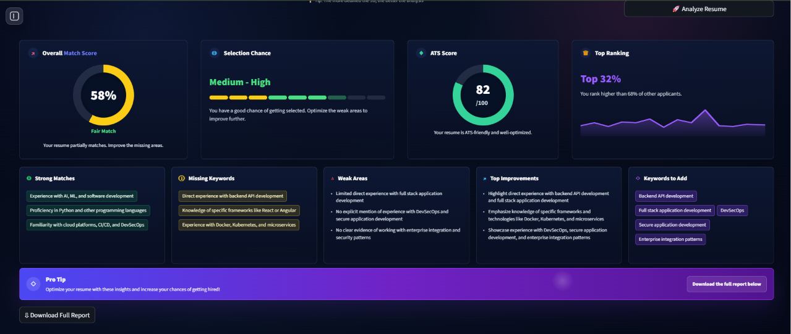

# 🚀 ResumeIQ AI

An AI-powered ATS Resume Analyzer built using Streamlit and Groq.

ResumeIQ AI helps job seekers understand how well their resume matches a job description by analyzing resume content, ATS compatibility, keyword alignment, and overall profile strength. The application provides detailed feedback and actionable suggestions to improve resume quality and increase interview chances.

---

## 🌐 Live Demo

🔗 [https://vyshnavishivuni-resumeiq-ai.hf.space](https://vyshnavishivuni-resumeiq-ai.hf.space)


# 📸 Screenshots

## 🏠 Application Interface



---

## 📊 Analysis Dashboard


---

# ✨ Features

* ATS compatibility analysis
* Resume vs Job Description matching
* AI-generated resume feedback
* Missing keyword detection
* Resume strength analysis
* Selection chance prediction
* Interactive score dashboard
* PDF resume upload support
* Modern responsive UI
* Real-time analysis using Groq LLM

---

# 🛠️ Tech Stack

### Frontend

* Streamlit
* HTML
* CSS

### Backend

* Python
* Groq API

### Libraries Used

* Streamlit
* PyPDF2
* Plotly
* python-dotenv

### Deployment

* Docker
* Hugging Face Spaces
* GitHub

---

# 📌 How the Project Works

1. User uploads a PDF resume
2. User pastes a job description
3. Resume text is extracted and processed
4. The application compares resume content with the JD
5. AI analyzes:

   * ATS compatibility
   * keyword match
   * strengths
   * missing skills
   * improvement areas
6. Final insights and scores are displayed through an interactive dashboard

---

# 📂 Project Structure

```bash
resumeiq-ai/
│
├── src/
│   └── app.py
│
├── requirements.txt
├── Dockerfile
├── config.toml
├── README.md
├── .gitignore
└── .env
```

---

# ⚙️ Local Setup

## 1. Clone Repository

```bash
git clone https://github.com/VyshnaviShivuni/resumeiq-ai.git
cd resumeiq-ai
```

---

## 2. Create Virtual Environment

### Windows

```bash
python -m venv venv
venv\Scripts\activate
```

### Mac/Linux

```bash
python3 -m venv venv
source venv/bin/activate
```

---

## 3. Install Dependencies

```bash
pip install -r requirements.txt
```

---

## 4. Configure Environment Variables

Create a `.env` file and add your Groq API key:

```env
GROQ_API_KEY=your_api_key_here
```

---

## 5. Run the Application

```bash
streamlit run src/app.py
```

---

# 🐳 Docker Deployment

Build Docker image:

```bash
docker build -t resumeiq-ai .
```

Run container:

```bash
docker run -p 8501:8501 resumeiq-ai
```

---

# 📊 Core Functionalities

* Resume parsing from PDF
* ATS score generation
* Keyword extraction and comparison
* AI-powered suggestions
* Resume match percentage
* Selection probability estimation
* Interactive visualization dashboard

---

# 🔐 Environment Variables

| Variable     | Description                          |
| ------------ | ------------------------------------ |
| GROQ_API_KEY | API key used for AI-powered analysis |

---

# 🚧 Future Improvements

* Resume history tracking
* Authentication system
* Multi-resume comparison
* Exportable PDF reports
* AI interview preparation assistant
* Resume template suggestions
* Skill gap roadmap generation

---

# 👩‍💻 Author

### Vyshnavi Shivuni

AI & ML Engineer passionate about building practical AI applications and modern user experiences.

GitHub: [https://github.com/VyshnaviShivuni](https://github.com/VyshnaviShivuni)

---

# ⭐ Support

If you found this project useful, consider giving it a star on GitHub.
